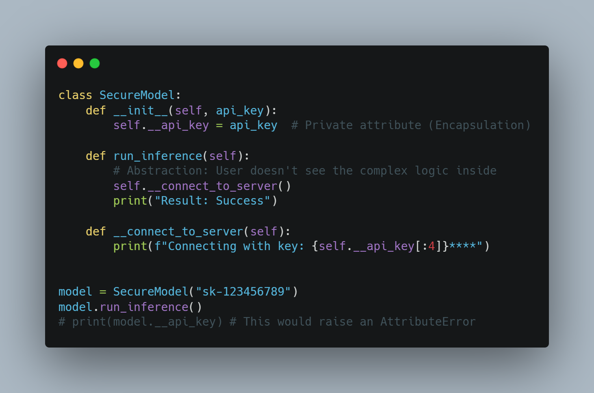

[](https://www.python.org)
[](https://pandas.pydata.org)

# FastTrack-Python-for-GenAI


# 30 Days of Python: Journey towards AI 🚀

This repository tracks my 30-day journey from Python fundamentals to the prerequisites of Generative AI. Inspired by the "30-Days-Of-Python" challenge.

## 📅 Roadmap
- **Week 1:** Core Programming & Environment Setup
- **Week 2:** Data Structures & Functional Python
- **Week 3:** Pandas Deep Dive & Data Wrangling
- **Week 4:** OOP & AI Prerequisites (GenAI)

## ⚡ Quick Start (Try it in 30 Seconds)

Don't wait! Run this to see if your environment is ready for AI:

```bash
# Clone and install dependencies
git clone clone https://github.com/NxtGenCodeBase/FastTrack-Python-for-GenAI.git
cd FastTrack-Python-for-GenAI
pip install -r requirements.txt

# Run the Day 1 Test
python Day_01_Setup/test_setup.py


## 🛠️ Setup Instructions
1. **Clone the repo:** `git clone https://github.com/NxtGenCodeBase/FastTrack-Python-for-GenAI.git`
2. **Environment:** Install [Miniconda](https://docs.conda.io) or [Anaconda](https://www.anaconda.com).
3. **Install Dependencies:** 
   ```bash
   pip install pandas numpy matplotlib seaborn plotly jupyter

### 2. Recommended Directory Structure
```text
.
├── README.md
├── requirements.txt
├── .gitignore
├── Day_01_Setup/
│   └── setup_notes.md
├── Day_02_IDEs/
│   └── ide_comparison.md
├── Day_03_Jupyter/
│   └── Jupyter_Basics.ipynb
├── Day_04_Basics/
│   └── basics.py
└── Day_05_Control_Flow/
    └── logic.py